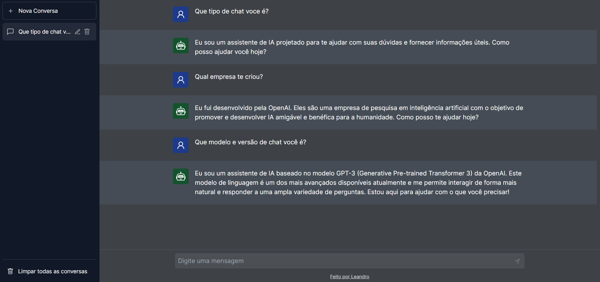

# Chat AI

## Sobre

Chat AI é uma interface de usuário avançada para interagir com a API da OpenAI, especificamente com o ChatGPT. Este projeto visa oferecer uma experiência de chat realista, permitindo aos usuários conversar, alternar entre conversas, personalizar nomes de chats, adicionar novas conversas e excluir conversas existentes.

## Funcionalidades

- **Integração com a API da OpenAI (ChatGPT)**: Converse com uma inteligência artificial avançada diretamente da sua interface.
- **Gestão de Conversas**: Alterne facilmente entre múltiplas conversas ativas usando a barra lateral de navegação.
- **Personalização de Conversas**: Altere o nome de cada chat para melhor organizar suas conversas.
- **Gerenciamento de Conversas**: Adicione novas conversas e exclua as que não são mais necessárias.

## Tecnologias Utilizadas

- next: 14.1.2
- openai: ^4.28.4
- tailwindcss: ^3.3.0
- typescript: ^5

## Começando

### Pré-requisitos

- Node.js instalado em sua máquina
- Uma chave API da OpenAI configurada como `NEXT_PUBLIC_OPENAI_API_KEY`

### Instalação

1. Clone o repositório para sua máquina local.
2. Instale as dependências necessárias com `npm install`.
3. Inicie a aplicação em modo de desenvolvimento com `npm run dev`.
4. A aplicação estará acessível via `localhost` no navegador.

## Uso

Após iniciar a aplicação, você será direcionado para a área de chat. Inicie uma conversa com o ChatGPT digitando na caixa de texto disponível.

## Contribuições

Por enquanto, não estou buscando contribuições ativas, mas sinta-se à vontade para abrir um pull request se tiver alguma sugestão de melhoria ou nova funcionalidade.

## Licença

Este projeto está disponível sob uma licença com atribuição. Veja o arquivo LICENSE para mais detalhes.

## Autor

Leandro Silva - Desenvolvedor Full Stack

- Email: leandrochagask@gmail.com

## Screenshots

